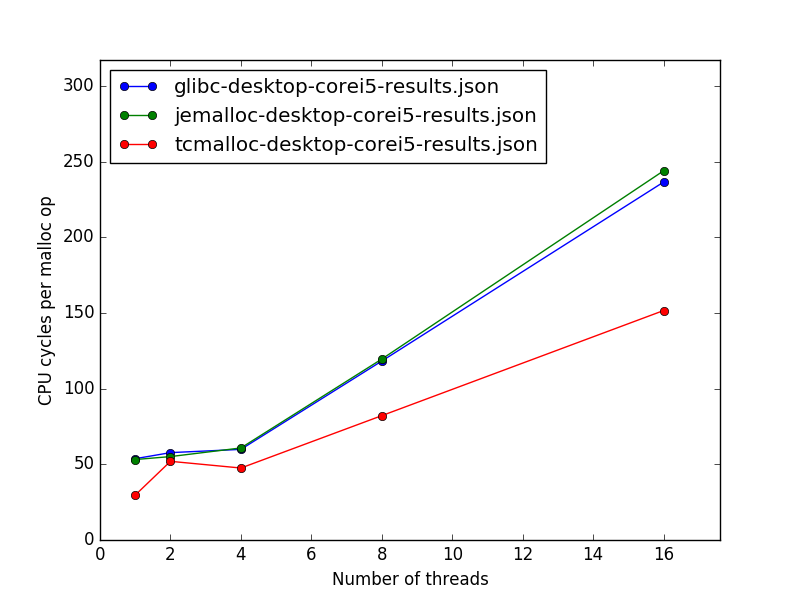

# malloc-benchmarks

Simple benchmarking scripts to run on any machine to compare different C/C++ malloc implementations.
The scripts are not meant to face any possible problem, quite the opposite.
They will:
 - download and build [GNU libc](https://www.gnu.org/software/libc/), [Google perftools](https://github.com/gperftools/gperftools), [Jemalloc](http://jemalloc.net/)
 - use GNU libc malloc multi-thread benchmarking utility to generate JSON results for different combinations
   of malloc implementation and number of threads
 - use [Python matplotlib](https://matplotlib.org/) to produce a summary figure


## How to collect benchmark results and view them

```
   git clone https://github.com/f18m/malloc-benchmarks.git
   cd malloc-benchmarks
   make
```


## How to collect benchmark results on a machine and plot them from another one

On the machine where you want to collect benchmark results:

```
   git clone https://github.com/f18m/malloc-benchmarks.git
   cd malloc-benchmarks
   make download build collect_results 
   scp -r results IP_OF_OTHER_MACHINE:
```

On the other machine where you want to plot results:

```
   git clone https://github.com/f18m/malloc-benchmarks.git
   cd malloc-benchmarks
   mv ../results .
   make plot_results
```


## Example benchmarks



