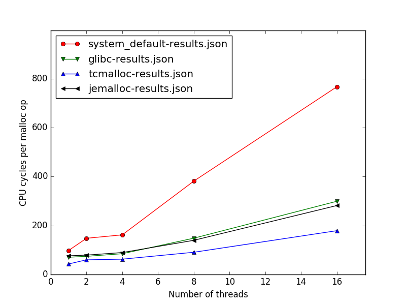
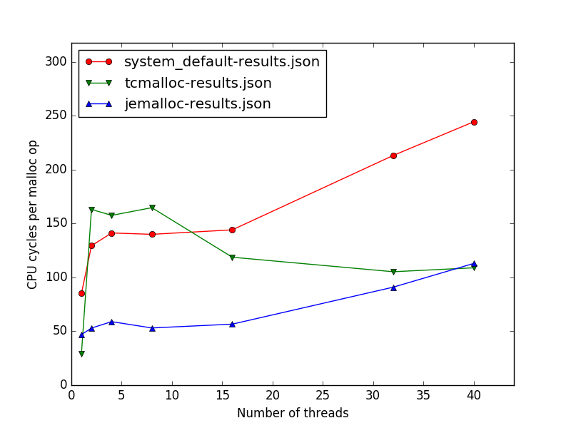

# malloc-benchmarks

Simple benchmarking scripts to run on any machine to compare different C/C++ malloc implementations.
The scripts are not meant to face any possible problem, quite the opposite.
They will:
 - download and build [GNU libc](https://www.gnu.org/software/libc/), [Google perftools](https://github.com/gperftools/gperftools), [Jemalloc](http://jemalloc.net/)
 - use GNU libc malloc multi-thread benchmarking utility to generate JSON results for different combinations
   of malloc implementation and number of threads
 - use [Python matplotlib](https://matplotlib.org/) to produce a summary figure


## How to collect benchmark results and view them

```
   git clone https://github.com/f18m/malloc-benchmarks.git
   cd malloc-benchmarks
   make
```


## How to collect benchmark results on a machine and plot them from another one

On the machine where you want to collect benchmark results:

```
   git clone https://github.com/f18m/malloc-benchmarks.git
   cd malloc-benchmarks
   make download build collect_results 
   scp -r results IP_OF_OTHER_MACHINE:
```

On the other machine where you want to plot results:

```
   git clone https://github.com/f18m/malloc-benchmarks.git
   cd malloc-benchmarks
   mv ../results .
   make plot_results
```


## Example benchmarks

The following are some pictures obtained on different HW systems using however the same benchmarking utility written by
GNU libc developers. They give an idea on how much performances can be different on different CPU/memory HW and varying the number of threads.
Of course the closer the curves are to zero, the better they are (the lower the better!).

<table cellpadding="5" width="100%">
<tbody>


<tr>
<td>


</td>
<td>

Relevant HW information of machine used for testing available [here](results/2018-02-11-desktop-corei5/hardware-inventory.txt)

'system_default' is GNU libc version 2.23 (default for Ubuntu 16.04 LTS)

'glibc' is GNU libc version 2.26

'tcmalloc' is Google gperftools version 2.6.3

'jemalloc' is Google gperftools version 5.0.1
</td>
</tr>


<tr>
<td>



</td>
<td>

Relevant HW information of machine used for testing available [here](results/2018-02-11-desktop-xeon3470/hardware-inventory.txt)

'system_default' is GNU libc version 2.23 (default for Ubuntu 16.04 LTS)

'glibc' is GNU libc version 2.26

'tcmalloc' is Google gperftools version 2.6.3

'jemalloc' is Google gperftools version 5.0.1
</td>
</tr>


<tr>
<td>



</td>
<td>

Benchmarking obtained running:

<pre>
make IMPLEMENTATIONS="system_default tcmalloc jemalloc" POSTFIX="server-xeon2680" NTHREADS="1 2 4 8 16 32 40" collect_results
</pre>

Relevant HW information of machine used for testing available [here](results/2018-03-17-server-xeon2680/hardware-inventory.txt)

'system_default' is GNU libc version 2.17 (default for Centos 7)

'glibc' curve is missing: the default GCC of Centos 7 is too old to build a recent GNU libc version.

'tcmalloc' is Google gperftools version 2.6.3

'jemalloc' is Google gperftools version 5.0.1
</td>
</tr>


</tbody>
</table>


## Contribute your own benchmarks

If you would like to contribute your benchmarks running on different hardware please
contact me at francesco DOT montorsi AT gmail DOT com.
Thanks.

